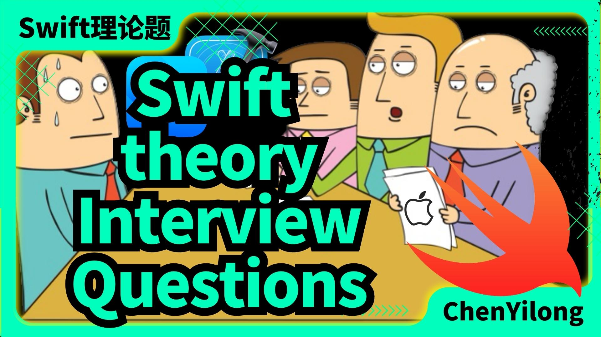
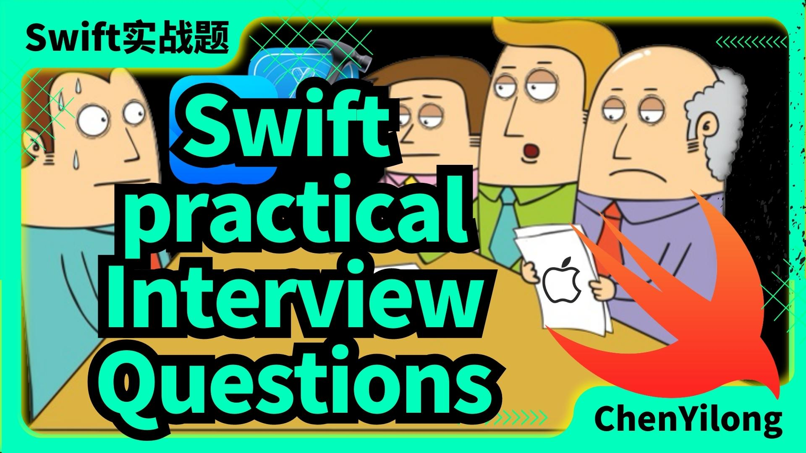

## iOS题目集锦（附答案）(Swift 版本)

- [《理论篇: Swift/ObjC 语言基础》](https://github.com/ChenYilong/iOSPracticeQuestions/blob/master/02_swift_topic_notes/theory.md) 

 - [《实战篇: iOS项目开发技能》]( https://github.com/ChenYilong/iOSPracticeQuestions/blob/master/02_swift_topic_notes/practical.md ) 
 